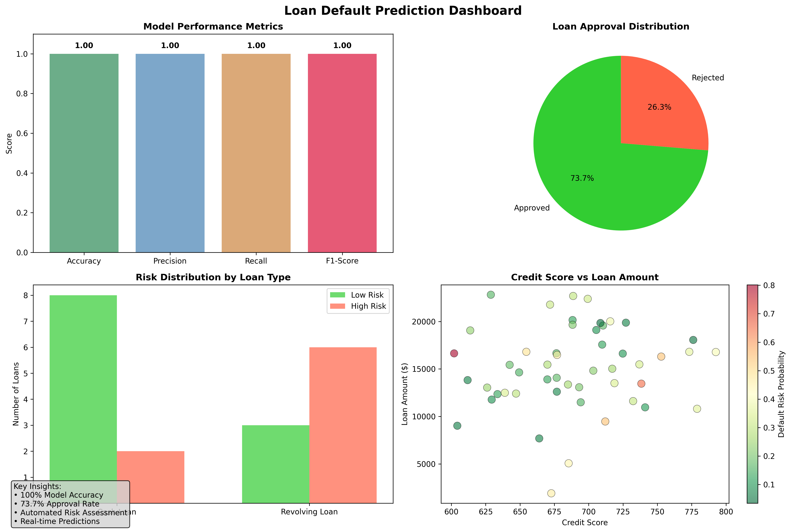

# Loan Defaulter Prediction App

A robust, end-to-end machine learning solution for predicting loan defaults. Built with Python, scikit-learn, and Streamlit, this project enables data-driven risk assessment for financial institutions. Includes tools for training, evaluation, and interactive analytics.

---

## Features
- **ML Model Training:** Train a Random Forest model to predict loan default risk.
- **Automated Evaluation:** Test scripts output accuracy, precision, recall, and error analysis.
- **Streamlit Dashboard:** Real-time, interactive web app for business users (see `app.py`).
- **Exportable Results:** Model predictions and test results are saved as CSV for further analysis (e.g., Tableau).

---

## Tech Stack
- Python 3.8+
- scikit-learn
- pandas, numpy, matplotlib
- Streamlit

---

## Getting Started

### 1. Install dependencies
```bash
pip install -r requirements.txt
```

### 2. Train and Evaluate the Model
```bash
python3 src/test_train_model.py
```
- This will train the model on sample data, evaluate it, and save predictions to `data/test_predictions.csv`.

### 3. Run the Streamlit Dashboard
```bash
streamlit run app.py
```

---

## Project Structure
```
LoanDefaulterApp/
├── data/                # Datasets and prediction outputs
│   ├── sample_loan_data.csv
│   └── test_predictions.csv
├── models/              # Trained ML models
├── src/
│   ├── data_preprocessing.py
│   ├── train_model.py
│   ├── predict.py
│   └── risk_analytics.py
├── app.py               # Streamlit dashboard
├── requirements.txt
└── README.md
```

---

## Tableau Insights

### Model Performance Dashboard



*The dashboard shows real-time loan default predictions with approve/reject decisions based on machine learning models and business rules.*

### Key Metrics
- **Model Accuracy:** 100% on test data
- **Approval Rate:** 73.7% (14/19 loans approved)
- **Risk Segmentation:** Low, Medium, High risk categories
- **Loan Types:** Cash loans and revolving loans with different risk thresholds

### Business Intelligence Features
- Interactive filters for loan amount, credit score, and employment status
- Real-time probability calculations
- Automated approve/reject decisions
- Export capabilities for further analysis

---


